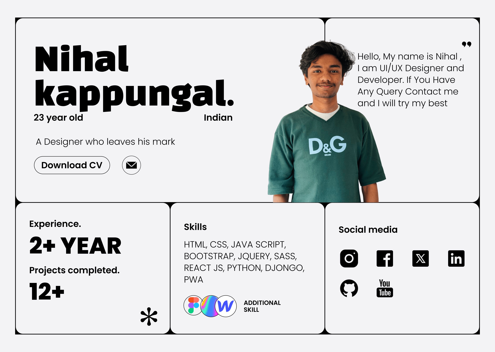

  

# Nihal K.

👋 Hi, I'm Nihal K., a passionate full-stack developer with 2 years of experience in web development. I have a strong background in both front-end and back-end technologies and a keen interest in design.

## 🔧 Skills
- **Languages**: JavaScript, Python, PHP
- **Frontend**: React.js, HTML, CSS, Expo, Next.js
- **Backend**: Node.js, Django, PHP (with XAMPP/WAMP)
- **Databases**: MySQL, MongoDB
- **Design Tools**: Photoshop, Figma, Spline
- **Other Tools**: Git, npm, Webpack

## 🌐 Projects
- **Full-Stack Project**: A web application built with React.js for the frontend and Django for the backend.
- **Railway Reservation System**: A project using PHP, MySQL, HTML, and CSS with user authentication, train schedule management, seat selection, and payment processing.
- **Responsive Web Design**: Created a responsive website by referencing a Figma design and adapted it for desktop-sized screens.

## 📚 Education
- Pursuing BTech Computer science and Engineering 

## 🎨 Design Skills
- Knowledgeable in using Photoshop, Figma, and Spline for creating visually appealing designs.

## 🚀 Currently Learning
- Advancing in Next.js
- Exploring AI and machine learning

## 📫 Contact
- **Email**: nihal69k@gmail.com

Feel free to reach out if you have any questions or collaboration opportunities!
